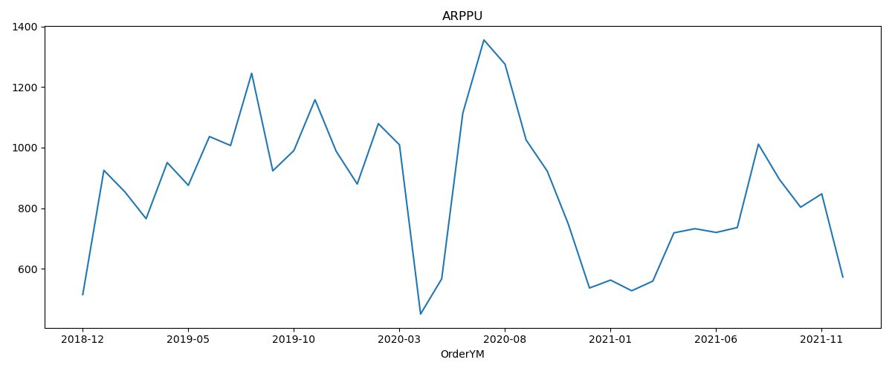
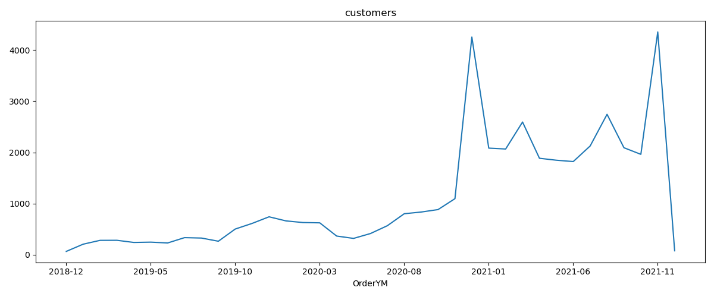
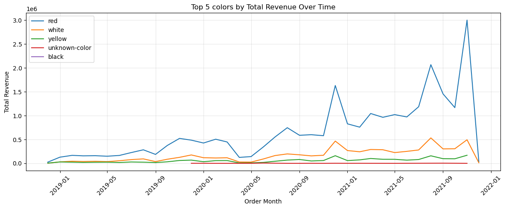
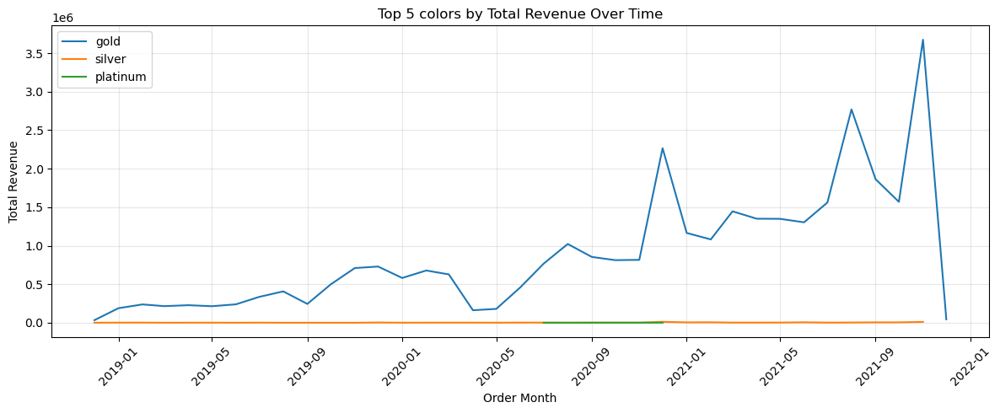
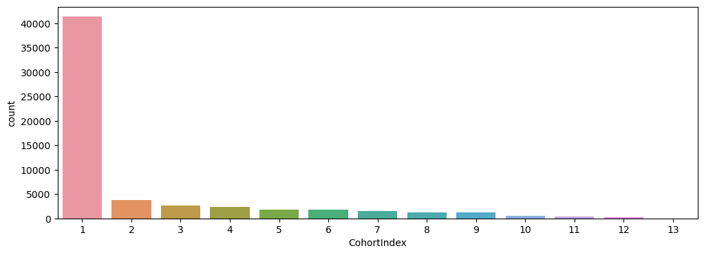
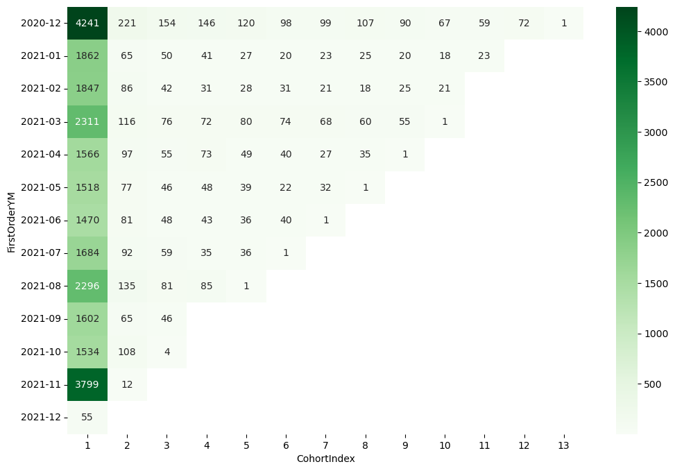
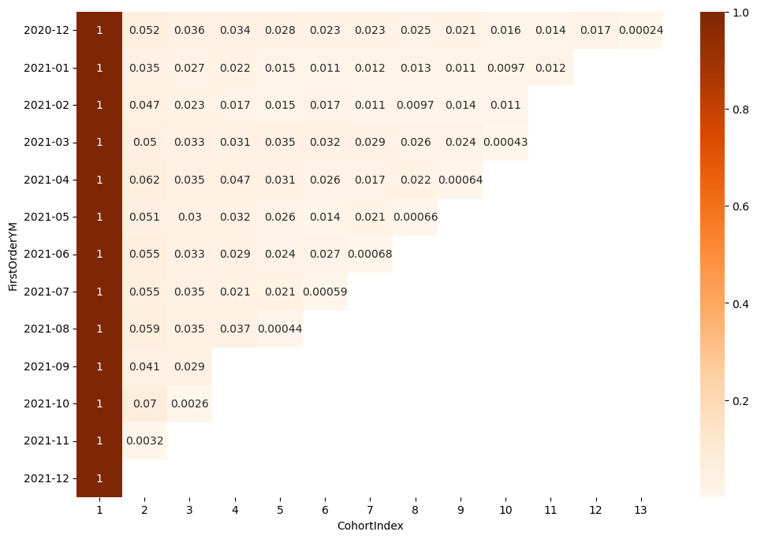
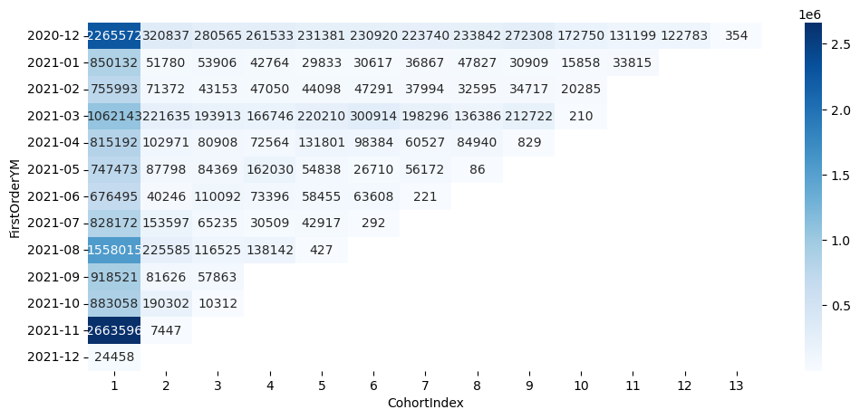
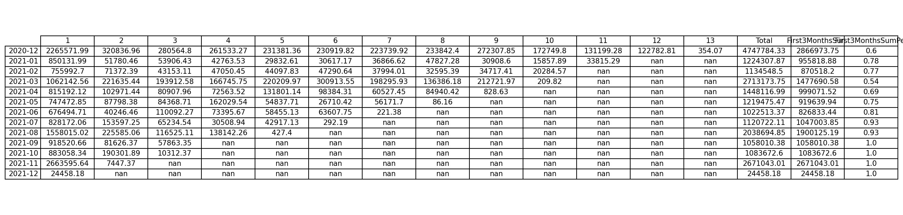

# Cohort Analysis

### **Abstract**

In this analysis, I will perform Data Cleaning, ARPU, ARPPU, MAU, and Cohort Analysis using the Jewler.csv dataset from Kaggle. These analyses will help uncover key trends in customer purchasing behavior, such as how much users are spending over time, how frequently new users are joining each month, and how well the platform retains those users over specific periods

Data Source: https://www.kaggle.com/datasets/mkechinov/ecommerce-purchase-history-from-jewelry-store/data

<ul>
<li><b>ARPU (Average Revenue Per User)</b> 
Measures the average revenue generated per user in a given time period. 
➤ Helps you understand overall monetization efficiency.</li>

<li><b>ARPPU (Average Revenue Per Paying User)</b> 
Measures the average revenue from only the users who made purchases in a month in this case. 
➤ Gives deeper insight into spending behavior among paying customers.</li>

<li><b>MAU (Monthly Active Users)</b> 
Counts how many unique users engaged with the platform in a given month. 
➤ Shows growth and engagement trends over time.</li>

<li><b>Cohort Analysis</b> 
Groups users by when they first interacted with the platform and tracks their behavior over time. 
➤ Helps measure retention, user loyalty, and the long-term value of customer segments.</li>
</ul>

### **Data Processing**

<ol>
<li>Loaded all dependencies/libraries for the data processing</li>
<li>Use Pandas df.shape, df.info(), df.describe() to see dataframe summaries</li>
<li>Change data types for order_date from object to datetime, then convert it to Eastern Time.</li>
<li>Remove the rows have null values in the column "user_id." Check other category columns to make sure the rows are not require for the analysis</li>
<li>Create ARPPU dataframe by grouping "OrderYM" and aggregating "TotalRevenue" & count unique "user_id", then calcualte ARPPU TotalRevenue divide by # of unique users per a month</li>
<li>Create "top5_gem" object to get the top 5 gem by revenue. Create "df_top5" dataframe to narrow down the original dataframe and "monthly_revenue," which is "TotalRevenue" groupby "gem" and "OrderYM". Same data processing for the color and metal</li>
<li>Create cust_agg dataframe to see summary of each customer's monetary value</li>
<li>Use pandas.DateOffset (to shift a date forward or backward by a specific time period) to filter the DataFrame to include only the past 12 months of records from the most recent order date</li>
<li>Get Year and Month difference from each customer's first order date and calculate "CohortIndex" with the formula "year_diff * 12 - + month + 1".</li>
<li>Calculate cohort_count by grouping filtered dataframe(df) by "FirstOrderYM" and "CohortIndex", and get frequency (by counting unique user_id) and TotalRevenue of each cohort. The retention rate can be calculated by dividing the total unique user_id on the first month (cohort_count[1]) or "cohort_count.div(cohort_count[1], axis=0)"

</ol>

### **Chart and Visualization**
<ul>
<li>Use df.hist(figsize=(12,8), bins=100) to see the brief distribution of each feature in the dataset</li>
<li>Plot line graphs to see monthly ARPPU (Average Revenue Per Paying User), Revenue, and # of customers</li>
<li>Top 5 gem, color, metal by revenue overtime </li>
<li>Use sns.coutplot to showcase the overall Cohortindex trend</li>
<li>Use sns.heatmap to display the number of cohorts by month, retention rate, and TotalRevenue</li>
<li>Use the first column of the dataframe "cohort_count" to display new customer acquisition trend</li>
</ul>

### **Analysis**
<ol type="I">
<li>Before diving into the analysis, I took the time to clean and organize the data, addressing issues such as missing values in key columns like user_id and other categorical fields that could potentially skew the results. I also converted the datetime column to a standardized timezone to ensure consistency and clarity across the team. 
</li>

<li>Like many other industries, the jewelry business saw a decline in the first half of 2020 due to the impact of COVID-19. In particular, I observed a significant drop in APPRU between March and April, followed by a rebound in June. It was interesting to see the highest ARPPU was on July 2020. While I can’t say with complete certainty, the uptick seems to be driven by growing demand for affordable jewelry and the rapid expansion of e-commerce—especially among companies like Signet, which owns brands such as Kay and Jared.

 
 
 
</li>

<li>
The high revenue peaks were observed in December 2020, August 2021, and November 2021. During these periods, diamonds emerged as the top-performing gem type, red was the most in-demand color, and gold recorded the highest sales volume

 
 
 

</li>

<li>
In line with the Pareto Principle, analysis revealed that the top 20% of customers contributed approximately 76% of the total revenue. This indicates a highly skewed distribution where a relatively small customer segment drives the majority of sales.
</li>

<li>
I could observe how total revenue evolves for overal cohort with below bar chart. This method later can be applied to different cohorts so that each cohorts can be compared and find which cohort have better rention rate.

 

Analyzing the cohort charts reveals key insights across customer numbers, retention rates, and revenue. The absolute numbers chart shows that the 2020-12 and 2021-11 cohorts had the highest customer counts in their starting months, with 2020-12 demonstrating a better retention rate than 2021-11. This suggests investigating the campaigns or events that may have driven customer retention in 2020-12. From the retention rate chart, the 2021-04 cohort stands out with the highest retention in the second month, warranting a deeper look into the events or campaigns that contributed to this success. On the revenue side, the 2021-11 cohort generated the highest initial revenue but experienced a sharp decline afterward, making it worth exploring the factors behind this drop and the initial spike. Additionally, the 2020-12, 2021-03, and 2021-08 cohorts showed stronger revenue in the first three months compared to others, indicating a need to examine the marketing strategies or initiatives implemented after the first month to understand what drove these results.

</li>

### **Conclusion**

The analysis provides a comprehensive view of the jewelry business's performance, highlighting both challenges and opportunities for growth. Despite an initial decline in early 2020 due to COVID-19, the business rebounded with a notable increase in ARPPU by July 2020, likely driven by a surge in demand for affordable jewelry and the rise of e-commerce. Revenue peaks in December 2020, August 2021, and November 2021 were dominated by diamonds, the color red, and gold, indicating strong seasonal and product-specific trends. The Pareto Principle was evident, with the top 20% of customers accounting for 76% of revenue, underscoring the importance of targeting high-value customers. Cohort analysis further revealed that the 2020-12 and 2021-11 cohorts had the largest customer bases, with 2020-12 showing better retention, while the 2021-04 cohort excelled in retention rates in the second month. Revenue insights showed 2021-11 with the highest initial revenue but a sharp drop-off, and cohorts like 2020-12, 2021-03, and 2021-08 generating stronger revenue in the first three months. These findings suggest a need to investigate the campaigns and strategies behind successful retention and revenue periods, such as those in 2020-12 and 2021-04, while also addressing the sharp revenue decline in 2021-11 to optimize future performance and customer engagement.

